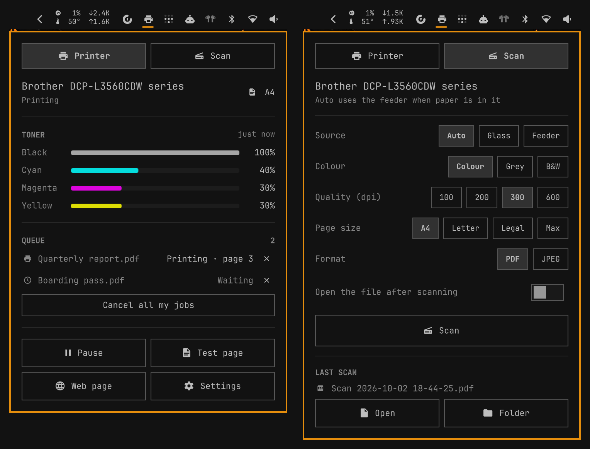

# Omarchy Printer

Printer status, toner levels and the print queue in the Omarchy bar. Uses only
what every Omarchy install already has — CUPS and Avahi — with no printer
drivers, vendor tools or extra packages.

<p align="center"></p>

## Features

- **Bar icon** that turns red on a problem (paper jam, out of paper, cover
  open, toner empty) and shows a crossed-out printer when the printer is
  paused or offline. Hover it for a one-line status.
- **Toner levels** in the printer's own colours, read straight from network
  printers so they are current, not only updated during a print job. Low toner
  turns red.
- **Status and paper:** Ready, Printing, Sleeping, Paused or Offline, any
  problem the printer reports, and the paper size that is loaded. A network
  printer that is switched off shows as Offline within about 30 seconds,
  even though CUPS itself only notices when it next tries to print.
- **Print queue** with a cancel button on each of your jobs, and *Cancel all
  my jobs*.
- **Actions:** pause or resume the printer, print a test page (click twice to
  confirm), open the printer's own web page, open printer settings.
- **Notifications** when a job finishes or fails, when paper runs out or jams,
  once when a toner runs low, and once when a job is waiting for a printer
  that is offline.
- **Several printers:** a picker appears when more than one is set up.

## Requirements

Every package below is in the official Arch repositories. Omarchy's base
install lists `cups`, `cups-filters`, `avahi`, `nss-mdns`, `uwsm` and
`system-config-printer`; the rest are normally pulled in as dependencies. The
plugin downloads nothing and needs no printer drivers or vendor tools.

| Package | Used for |
|---|---|
| `cups` | the print system: `ipptool` for status, toner and the queue; `lpstat`, `lp`, `cancel`, `cupsenable`, `cupsdisable` |
| `cups-filters` | printing the test page and driverless (IPP Everywhere / AirPrint) printing |
| `avahi` | `avahi-browse`, to find network printers and their web page |
| `nss-mdns` | resolving `.local` printer names |
| `python` | the status script (standard library only, no pip packages) |
| `libnotify` | `notify-send`, for notifications |
| `polkit` | `pkexec`, for the password prompt when pausing or resuming |
| `xdg-utils` | `xdg-open`, for the printer's web page |
| `uwsm` | launching printer settings (part of Omarchy) |
| `system-config-printer` | *optional*, the **Settings** button |

Install anything missing with:

```sh
omarchy pkg add cups cups-filters avahi nss-mdns python libnotify polkit xdg-utils system-config-printer
```

The CUPS and Avahi services must be running, and `mdns_minimal` must be in the
`hosts:` line of `/etc/nsswitch.conf` (Omarchy sets both up):

```sh
sudo systemctl enable --now cups.socket avahi-daemon.service
```

You also need a printer already added to CUPS (Omarchy's printer setup, or
`system-config-printer`). Toner and paper readings need a printer that speaks
IPP (any AirPrint, IPP Everywhere or Mopria printer); others still show status
and the queue.

## Install

```sh
omarchy plugin add https://github.com/navjottomer/omarchy-printer.git --enable
```

This clones the plugin into `~/.config/omarchy/plugins/navjottomer.printer/`,
validates it and puts it on the bar.

## Update

```sh
omarchy plugin update navjottomer.printer
```

## Remove

```sh
omarchy plugin remove navjottomer.printer
```

Nothing else is left behind.

## Usage

| Action | Result |
|---|---|
| click the bar icon | open or close the panel |
| right-click the bar icon | open printer settings |
| ✕ next to a job | cancel that job |
| Pause / Resume | stop or restart the printer (asks for your password) |
| Test page | click twice within 3 seconds to print CUPS's test page (`default-testpage.pdf`) |
| Web page | open the printer's built-in web page |
| Tab / Shift+Tab | switch to the next bar panel |
| Esc | close |

Pausing a printer is an admin action in CUPS, so it goes through `pkexec`
and the Omarchy password prompt. Cancelling your own jobs needs no password.

## Settings

Set with `omarchy bar set navjottomer.printer <key> <value>`:

| Key | Default | Meaning |
|---|---|---|
| `tonerColors` | `real` | `real`: each toner in its own colour; `theme`: the theme accent |
| `notifications` | `true` | notify on finished jobs, paper problems and low toner |

With real colours, a very dark toner (black) is drawn in the theme's text
colour so it stays visible on a dark bar.

## How it works

`bin/omarchy-printer` is one long-lived Python process. It:

1. asks the local CUPS scheduler (`ipptool`) for printers, their state and the
   queue — every 2 seconds while anything is printing, every 15 seconds
   otherwise;
2. on each poll, opens and closes a connection to each network printer (2 s
   limit, no new process); two misses in a row, or a printer no longer
   announced on the network, mean Offline;
3. finds network printers with `avahi-browse` and asks them directly for
   toner, loaded paper and alerts every 5 minutes, and right after a job
   finishes;
4. prints one JSON line to the panel only when something changed, and sends
   notifications itself.

The panel sends it `refresh` after an action so the result shows at once.

**Bounds.** At most 8 printers, 8 toners and 20 jobs per record, text fields
clipped to 80 characters, and each record capped at 32 KB. All
printer-supplied text is shown as plain text, never as markup. Actions run
with fixed arguments, never through a shell.

## License

[MIT](LICENSE)
